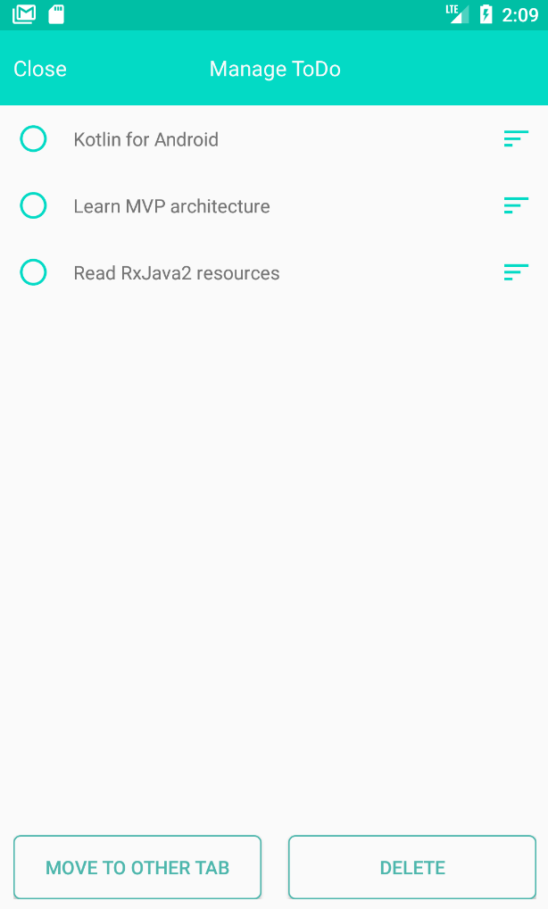

# ToDoListApp
Task Management App built with LiveData + Room + MVVM. 
During the development of this application, I had paid close attention to what each component in MVVM should be responsible for,
in order to achieve a high level of separation of concerns. By following MVVM architecture, the project remains clean and easily maintainable as
each component has distinctive roles. 
Also, by adopting LiveData with Room database, View components can always display the newest data with less codes and less coupling between View and ViewModel.
Since a View component observe LiveData owned by its ViewModel component, it will be notified whenever any changes occured inside database throughout user interactions.

## States of this app

## HomeFragment
 

  
HomeFragment does...

  <ol>
    <li>Displays all Tab's names inside ViewPager where a user can easily switch to other Tabs.
    <li>Displays all ToDos (Tasks) belong to the currently displayed Tab.
    <li>Allow users to add new ToDos by clicking on + button on bottom left.
    <li>Allow users to delete checked (completed) ToDos by clicking on Trash button on bottom right.
    <li>Allow users to edit a content of a ToDo.

 
 
 

