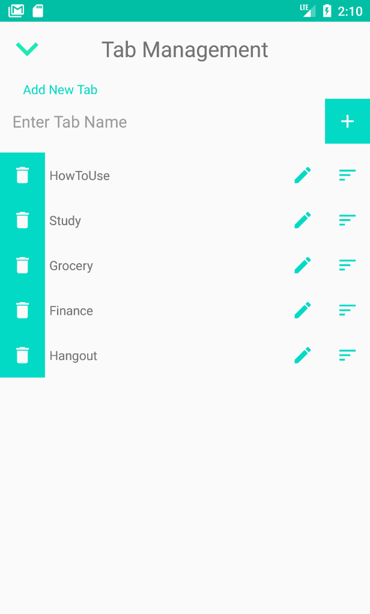

# ToDoListApp
Task Management App built with LiveData + Room + MVVM. 
During the development of this application, I had paid close attention to what each component in MVVM should be responsible for,
in order to achieve a high level of separation of concerns. By following MVVM architecture, the project remains clean and easily maintainable as
each component has distinctive roles. 
Also, by adopting LiveData with Room database, View components can always display the newest data with less codes and less coupling between View and ViewModel.
Since a View component observe LiveData owned by its ViewModel component, it will be notified whenever any changes occured inside database throughout user interactions.

## States of this app

  
  
  

## HomeFragment
 

  - Displays all Tab's names inside ViewPager where a user can easily switch to other Tabs.
  - Displays all ToDos (Tasks) belong to the currently displayed Tab.
  - A user can add new ToDos by clicking on + button on bottom left.
  - A user can delete checked (completed) ToDos by clicking on Trash button on bottom right.
  - A user can edit a content of a ToDo.
  
## ItemManagementFragment

  - A user can select multiple items in a list
  - Selected items in a list can be deleted with Delete button or moved to other Tab with Move-To-Other-Tab button.
  - Cliking on the icon on the right will commence a dragging action. With drag and drop items, users can reorder how items should be displayed.

## TabManagementFragment

  - Users can add new Tabs, delete Tabs, and edit the title of Tabs.
  - Cliking on the icon on the right will commence a dragging action. Users can rearrange the order of how Tabs should be displayed.
  

## Library reference resources:

1. Room: https://developer.android.com/topic/libraries/architecture/room.html
